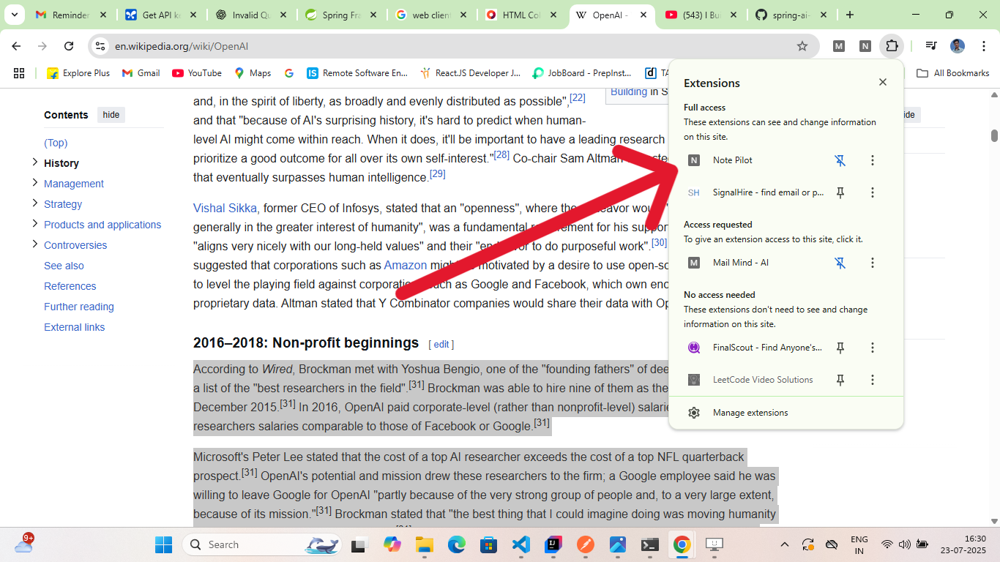
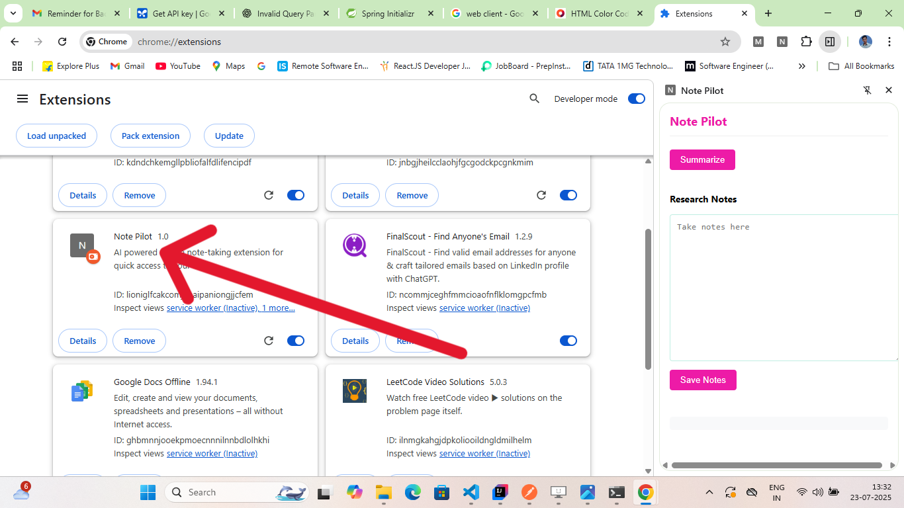

<h1>Note Pilot</h1>

Developed a Chrome extension that leverages Google's Gemini API to generate concise summaries of web articles. Enables users to extract, highlight, and save key points locally for quick reference.
Tech Stack: Spring Boot (Backend), HTML/CSS/JavaScript (Frontend), Chrome Extension APIs, Gemini API.

## 🎥 Demo

## 📸 Screenshots

##

